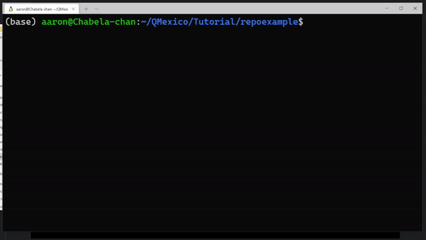

La manera de reportar nuestros cambios y darles seguimiento con git es por medio del comando:

```
git add nombre_del_archivo
```

O si queremos agregar todos los movimientos a la vez utilizando la ruta "."

```
git add .
```

 
