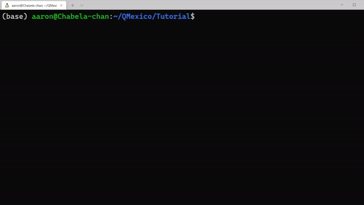

Como su nombre lo indica, una branch es una rama de cambios en nuestro repositorio donde podemos realizar cambios.

Una nueva rama se genera con el comando:

```
git checkout -b nombre_de_la_rama
```

Esto crea la rama y nos mueve a ella.

 
