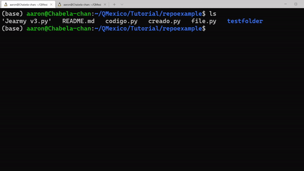

Con los archivos de manera local podemos hacer las modificaciones que veamos necesarias.

El comando:

```
git diff
```
puede resultarnos útil ya que nos arroja todas las modificaciones que hemos realizado con respecto al git clone.


 
