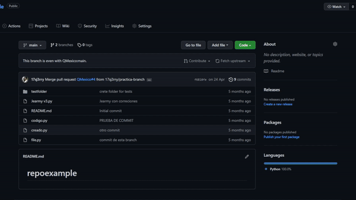

Con el comando git clone, hacemos una copia de los archivos presentes en el repositorio de manera local, descargandolos y permitiendo su modificación de manera adecuada.

Esta copia podemos hacerla mediante el comando:

```
git clone dirección_a_la_branch
```


