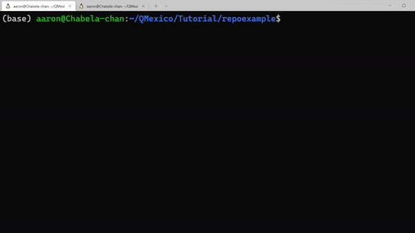

Cuando todos los cambios que requerimos estan hechos y solo resta confirmarlo, nos apoyamos del comando:

```
git commit
```

Lo que nos desplegara un editor, para dar el mensaje obligatorio sobre la versión que estamos a punto de subir o su versión reducida.

```
git commit -m "Mensaje para este commit"
```


