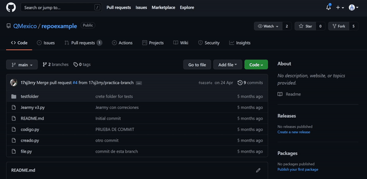

La forma más sencilla de hacer un fork es por medio de la página de GitHub, en nuestro repositorio de prueba solo tenemos que dar click en el botón de Fork de la parte superior y haremos una copia del repositorio asociada a nuestra cuenta.

