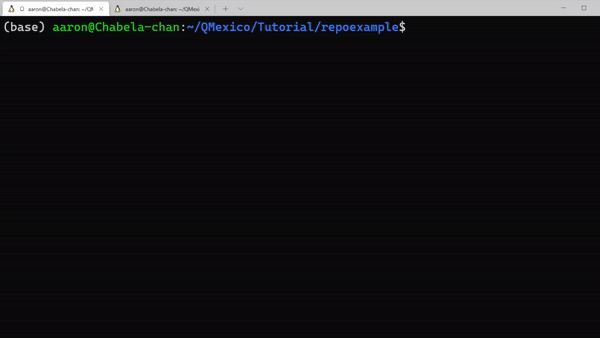

La parte local de los cambios han sido realizados, así que lo que resta es hacer una actualización en nuestro repositorio remoto, esto lo realizaremos con el comando:

```
git push
```

Y en caso de tratarse de la primera vez que realizamos un cambio utilizaremos el comando

```
git push --set-upstream origin nuestra_branch
```



Finalizada esta parte entramos al periodo de revisión.
